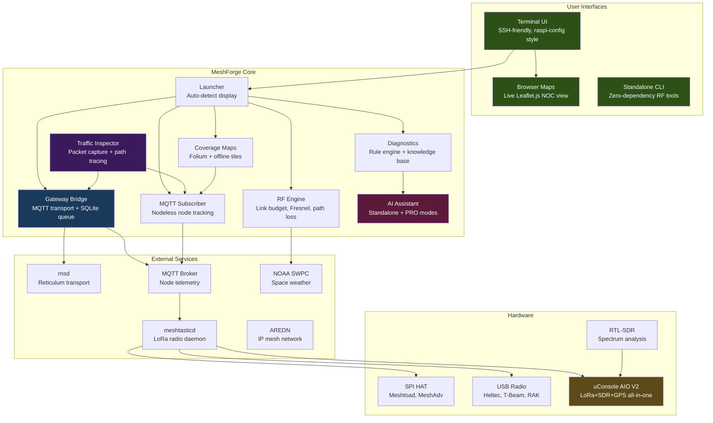
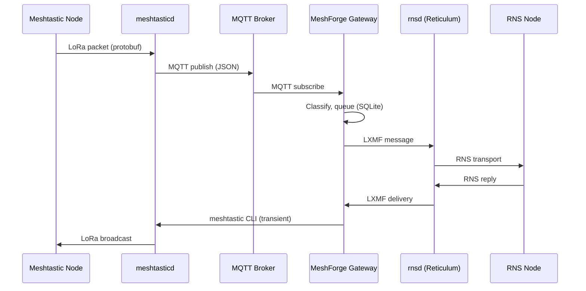

# MeshForge

<p align="center">
  
</p>

<p align="center">
  <strong>Mesh Network Operations Center & Development Ecosystem</strong><br>
  <em>Meshtastic + Reticulum + AREDN — Build. Test. Deploy. Monitor.</em>
</p>

<p align="center">
  <a href="https://github.com/Nursedude/meshforge"></a>
  <a href="LICENSE"></a>
  <a href="https://python.org"></a>
  <a href="https://github.com/Nursedude/meshforge/actions"></a>
</p>

<p align="center">
  <a href="https://nursedude.substack.com">Development Blog</a> |
  <a href="https://github.com/Nursedude/meshforge/issues">Report Issues</a> |
  <a href="#contributing">Contribute</a>
</p>

---

## What is MeshForge?

**MeshForge turns a Raspberry Pi into a mesh network operations center and development platform.**

Plug in a LoRa radio, run the installer, and you get:
- A **gateway** bridging Meshtastic and Reticulum via MQTT (zero interference)
- **Live NOC maps** showing Meshtastic AND RNS nodes on one map
- **Coverage maps** with SNR-based link quality
- **Wireshark-grade packet inspection** for both networks
- **RF engineering tools** for site planning
- **meshtastic CLI** integration for radio config (transient, no interference)
- **AI diagnostics** that work offline
- **mini-dudeai** — a deterministic rule-loop agent that watches fleet health 24/7 and pages on real signals (no LLM in the hot path)

Optional add-ons (install from TUI when you need them):
- **NomadNet** — terminal-based LXMF client (Reticulum users)
- **Dude-claw** — mini-dudeai's physical-world mode: a Pi brain driving WireClaw ESP32 edge nodes over NATS (sensors → rules → actuators + an OLED the fleet paints metrics onto; `--preset standalone`). Includes the **chat-compiler**: speak a rule in English to a local offline LLM, ratify it, and the running daemon promotes it (`python3 -m mini_dudeai.chat`)

### Extensions (install from TUI: Maps & Viz menu)

| Extension | Description | Port | Repo |
|-----------|-------------|------|------|
| **[MeshForge Maps](https://github.com/Nursedude/meshforge-maps)** | Multi-source map (Meshtastic, AREDN, MeshCore, MQTT, RNS) | 8808 | `Nursedude/meshforge-maps` |
| **Meshing Around** (client/monitor) | Alerting + maps-writer layer for the meshing-around bot — **not** the bot itself | — | `Nursedude/meshing_around_meshforge` |
| **MeshChatX** ([setup](docs/MESHCHATX_IN_MESHFORGE.md)) | Browser-based LXMF chat client — sibling to NomadNet (isolated RNS, propagation, gateway-enrolled) | 8000 | RNS-Things / Quad4-Software |

> **Two "meshing-around" repos — don't conflate them:** `Nursedude/meshing_around_meshforge`
> (above) is the **client/monitor + alerting** layer (v0.6.0). The actual command
> **bot** is a separate fork, `Nursedude/meshing-around` (a T2 fork of
> `SpudGunMan/meshing-around`, floating upstream v1.9.9.x, governed by its `FORK.md`).

Extensions are managed as systemd services. The TUI handles the full lifecycle:
- **Install**: clone, venv, deps, service setup — one click
- **Auto-diagnose**: detects wrong user, missing venv, permission errors
- **Fix Service**: one-click auto-repair for broken service files
- **Manage**: start/stop/restart, view logs, health check, configure

### The Vision

Modern mesh networks are fragmented. Meshtastic nodes can't talk to Reticulum nodes. AREDN operates on a different layer entirely. Each ecosystem has its own tools, its own interfaces, its own learning curve.

**MeshForge unifies them.**

One interface to monitor Meshtastic, Reticulum, and AREDN. One gateway to bridge messages between incompatible meshes. One toolkit for RF planning, diagnostics, and field operations. All running on a $35 Raspberry Pi that you can SSH into from anywhere.

This is the first open-source tool to bridge Meshtastic (LoRa mesh) with Reticulum (encrypted transport layer). No cloud dependencies. No subscriptions. Just a box that makes mesh networks work together.

```bash
sudo python3 src/launcher_tui/main.py
```

**Built for:** HAM operators, emergency comms teams, off-grid builders, preppers, and mesh enthusiasts who want professional-grade network visibility without the complexity.

### How It's Operated — a Human + AI Fleet

The reference fleet (multiple Pis across home-LAN and AREDN-linked remote sites, plus a cloud peer) is run as a **human+AI collaboration**: a HAM operator pair-engineering with Claude — architecture, code, and live fleet operations over SSH — while two on-box organs keep watch between sessions:

- **The watchdog** — one probe per failure class learned in the field (wedged RPC, fd leaks, permission drift, role drift, channel silence…). Every real incident becomes a probe; nothing is diagnosed twice.
- **mini-dudeai** — a tiny on-box rule engine that turns watchdog signals into per-box briefs, fleet-wide rollups, and pages. The next session warm-starts from what mini saw.

The loop compounds: incidents → probes → signals → briefs → faster sessions. A recent data point — a brand-new Pi at a remote AREDN site went from bare SSH to fully-federated, lab-measured fleet member *in one evening*, surfacing (and fixing) two latent cross-repo bugs along the way. The collaboration record lives in [`docs/substack/`](docs/substack/) and the development blog.

---

## Live Demo

See the Hawaii fleet's view of the LoRa mesh — node positions, SNR-coloured link quality, NOAA space weather, and active space-weather alerts — at **[meshforge-maps.ddns.net](https://meshforge-maps.ddns.net/)**.

The demo runs on a small VPS that mirrors a regional GeoJSON snapshot from one fleet box every two minutes via `scripts/cloud/push_snapshot.sh`. The mesh itself stays on-prem; only the map data is published. The page is mobile-friendly (tested on iOS, 13" MacBook, larger displays) and shows per-protocol counts (Meshtastic / AREDN / MeshCore) alongside SFI, X-ray, geomagnetic storm level, and per-band HF condition pills.

To stand up your own VPS demo, see `scripts/cloud/README.md` — one-shot setup via `setup_vps.sh <domain>` on a fresh Ubuntu 24.04 box.

---

## Quick Start

> **Already running MeshForge?** See [Upgrading](#upgrading-meshforge) for upgrade paths.

### Hardware

MeshForge runs on a Raspberry Pi. The tested baseline is a mix of **Pi 3B, Pi 4,
and Pi 5** boards (all 64-bit / `aarch64`) — any of these runs the full NOC stack
(map server, gateway bridge, Reticulum, MQTT) comfortably.

**You don't need a Pi 4 to start.** Small boards are workable — not a deal-breaker —
*because the software is tuned to fit the box*, not because the hardware is roomy.
A **Pi Zero 2 W** (quad-core, 512 MB, ~$15) is the recommended low-cost board for a
lightweight or single-purpose node, and a dedicated bot node has run for weeks on the
original (1st-gen) **Pi Zero W**. On a 512 MB board:

- **Keep the memory-saving defaults on.** The node directory uses a bounding-box
  filter plus a node-count cap, and the large API responses (`/api/nodes/directory`,
  `/api/nodes/geojson`, `/api/network/topology`) are byte-cached. Together these keep
  RAM and the on-disk DB small — on one box the node DB dropped from multiple GB to
  single-digit MB once the bbox filter and cap were set. Don't disable them on a
  constrained board.
- **Expect some swap** under the map service on a large mesh; a high-endurance SD card
  (or a USB SSD) helps latency and reduces card wear.
- **Single-purpose roles do best on Zero-class boards** (a dedicated gateway or bot).
  The full NOC stack is happier on a Pi 3B or larger.
- **1st-gen Pi Zero W (`armv6`):** fine for a dedicated lightweight node, but its single
  core and aging `armv6` Python-package support make a **Pi Zero 2 W or Pi 3B+ the
  better entry choice** for anything new.

### Fresh Install

```bash
git clone https://github.com/Nursedude/meshforge.git
cd meshforge
sudo bash scripts/install_noc.sh    # Full NOC stack install
```

The installer auto-detects your radio hardware (SPI HAT or USB), installs
meshtasticd + Reticulum, and sets up systemd services. It will prompt you
to select your HAT if SPI is detected.

**Installer options:**
```bash
sudo bash scripts/install_noc.sh --skip-meshtasticd   # Don't install meshtasticd
sudo bash scripts/install_noc.sh --skip-rns            # Don't install Reticulum
sudo bash scripts/install_noc.sh --client-only         # MeshForge only (no daemons)
sudo bash scripts/install_noc.sh --force-native        # Force SPI mode
sudo bash scripts/install_noc.sh --force-python        # Force USB mode
```

### MeshAnchor (MeshCore-Primary Sister App)

**[MeshAnchor](https://github.com/Nursedude/meshanchor)** is the sister project
where MeshCore is the primary radio and Meshtastic is an optional gateway — the
mirror image of MeshForge's architecture.

```
MeshForge (this repo)          MeshAnchor (live)
  Primary: Meshtastic            Primary: MeshCore
  Gateway to: MeshCore/RNS       Gateway to: Meshtastic/RNS
```

MeshAnchor was extracted from MeshForge main on 2026-04-01. Both share the same
TUI framework, gateway bridge, and RF tools. They differ in which radio is "home."

```bash
git clone https://github.com/Nursedude/meshanchor.git
cd meshanchor
sudo python3 src/launcher_tui/main.py
```

### Deployment Profiles

MeshForge supports 5 deployment profiles. Install only the dependencies you need:

| Profile | Services Needed | Install | Use Case |
|---------|----------------|---------|----------|
| `radio_maps` | meshtasticd | `pip install -r requirements/core.txt -r requirements/maps.txt` | Radio config + coverage maps |
| `monitor` | (none) | `pip install -r requirements/core.txt -r requirements/mqtt.txt` | MQTT packet analysis |
| `meshcore` | (none) | `pip install -r requirements/core.txt` + meshcore | MeshCore companion radio |
| `gateway` | meshtasticd, rnsd | `pip install -r requirements/core.txt -r requirements/rns.txt -r requirements/mqtt.txt` | Meshtastic <> RNS bridge |
| `full` | meshtasticd, rnsd, mosquitto | `pip install -r requirements.txt` | Everything |

```bash
# Select profile at launch
python3 src/launcher.py --profile gateway

# Auto-detect (default): scans running services and installed packages
python3 src/launcher.py

# Profile is saved to ~/.config/meshforge/deployment.json
```

### Already Have meshtasticd?

```bash
sudo python3 src/launcher_tui/main.py
```

### RF Tools Only (no sudo, no radio)

```bash
python3 src/standalone.py
```

### Upgrade / Reinstall

Already running MeshForge? Pick your path:

```bash
# Option 1: Clean reinstall (recommended)
# Backs up configs → removes code → fresh clone → restores configs
# Your radio, RNS identity, and MQTT broker are NOT touched
sudo bash /opt/meshforge/scripts/reinstall.sh

# Option 2: Quick update (code + service files)
cd /opt/meshforge && sudo bash scripts/update.sh

# Option 3: Manual git pull (developers)
cd /opt/meshforge && sudo git pull origin main
```

**Upgrading from pre-v0.5.4?** The gateway now uses MQTT instead of TCP.
**Upgrading from v0.5.4?** The old in-app MeshChat handler was removed (upstream unmaintained). For a
browser-based LXMF client, **MeshChatX** is now integrated as an opt-in sibling to NomadNet — see
**[docs/MESHCHATX_IN_MESHFORGE.md](docs/MESHCHATX_IN_MESHFORGE.md)** for the full domain setup
(isolated install, propagation node, gateway enrollment, bot round-trips). NomadNet remains the
default LXMF client.
Install mosquitto (`sudo apt install mosquitto`) and configure via
`TUI → Gateway Config → MQTT Bridge Settings → Run Setup Guide`.

After any upgrade, verify:
```bash
sudo bash scripts/verify_post_install.sh
```

### TUI Menu Structure

The TUI uses a raspi-config style interface (whiptail/dialog) designed for SSH and
headless operation. Navigation is keyboard-driven with max 10 items per menu level:

```
Main Menu (MeshForge NOC)
├── 1. Dashboard             Service status, health, alerts, data path check
├── 2. Mesh Networks         Meshtastic, RNS, MeshCore, AREDN, MQTT, Gateway
│       └── RNS submenu      NomadNet Client (install/manage)
├── 3. RF & SDR              Link budget, site planner, frequency slots, SDR
├── 4. Maps & Viz            Live NOC map, coverage, topology, traffic inspector
├── 5. Configuration         Radio, channels, RNS config, services, backup
├── 6. System                Hardware detect, logs, network tools, shell, reboot
├── q. Quick Actions         Common shortcuts (2-tap access)
├── e. Emergency Mode        Field ops, weather/EAS alerts, SOS beacon
├── a. About                 Version, web client, help
└── x. Exit
```

**Design principles** (inspired by
[raspi-config](https://www.raspberrypi.com/documentation/computers/configuration.html)):
- Max 10 items per menu (cognitive load limit)
- Grouped by user task, not technical domain
- 2-tap max for common operations via Quick Actions
- Startup checks detect conflicts, verify services, warn on misconfigs

---

## What Works (v0.6.2-beta)

### Status Definitions

| Status | Meaning |
|--------|---------|
| **Field-Tested** | Validated in real deployments with actual hardware and services |
| **Beta** | Code works in automated tests, needs real-world soak time |
| **Code-Ready** | Implemented and unit-tested, not yet validated with hardware/services |
| **MeshAnchor** | Live at [Nursedude/meshanchor](https://github.com/Nursedude/meshanchor), field testing in progress |

### Field-Tested (Real-World Validated)

These features have been used in actual mesh deployments with physical radios and running services:

| Category | Capabilities |
|----------|-------------|
| **TUI Interface** | Installer, service control, device config wizard, gateway config, diagnostics — <!--STAT:handlers-->102<!--/STAT--> handler modules via registry pattern |
| **Radio Management** | Install/configure meshtasticd, LoRa presets, channels, SPI/USB auto-detect |
| **RF Engineering** | Link budget, Fresnel zone, path loss, site planning, space weather (NOAA), Cython-optimized |
| **AI Diagnostics** | Offline knowledge base (20+ topics), rule-based troubleshooting, confidence scoring |
| **RNS/Reticulum** | Config editor, interface templates, rnstatus/rnpath, identity management, shared instance detection (domain socket + TCP + UDP), pre-flight checks |
| **NomadNet** | Install/launch/configure via TUI, LXMF messaging |
| **meshtasticd** | Full lifecycle management, SPI HAT and USB radio auto-detection |
| **Service Management** | systemd integration via `service_check.py` (single source of truth), health monitoring |
| **First-Run Wizard** | Hardware auto-detect templates, region selection, service verification |
| **Standalone RF Tools** | Zero-dependency RF calculator, works without sudo or radio hardware |
| **Multi-Mesh Gateway** | Meshtastic ↔ RNS/LXMF bridge via MQTT, composable-bridges model, refusal-on-inconsistency preflight, persistent SQLite queue. Field-deployed across the operator's 5-box LAN fleet + 1 cloud peer (since 2026-04-24) |
| **Gateway + RNode** | rnsd RNodeInterface on USB LoRa radio alongside Meshtastic HAT; RNS-LoRa egress at 903.625 MHz / SF7 — validated on fleet-host-3 |
| **Dude-claw (standalone agent)** | mini-dudeai brain + WireClaw ESP32 edge over NATS: sensor polls → threshold rules → actuation + pages, end-to-end proven on a Heltec V4 (2026-06-11). Display fork (`0.4.0+dudeclaw.N`) paints fleet metrics onto the board's OLED via a cron-verdict-wired pusher; stdlib NATS client, no new runtime deps |

### Beta (Automated Tests Pass, Needs Field Validation)

Code works in testing but hasn't been validated in real-world deployments with actual traffic:

| Category | Capabilities | Notes |
|----------|-------------|-------|
| **Radio Failover** | Dual-radio state machine, automatic TX switchover at >25% channel utilization, anti-flap, HTTP health polling | Needs dual meshtasticd |
| **Dual-radio mesh_bridge serial** | Cross-preset bridge (LF HAT + ST USB) via `connection_type: "serial"` on secondary — code merged + unit-tested, live-probed on a fleet box's Heltec | Needs sustained cross-preset traffic to validate |
| **MQTT Monitoring** | Nodeless mesh observation, protobuf decode, telemetry tracking, congestion alerts | Needs real MQTT traffic |
| **Coverage Maps** | Interactive Folium maps, SNR-based link quality, offline tile caching | **Priority QA target** — needs GPS position data |
| **Live NOC Map** | Browser view with WebSocket updates, node markers, signal heatmap | **Priority QA target** — needs running bridge |
| **Traffic Inspector** | Packet capture, protocol tree, display filters, path tracing | Needs real packet flow |
| **Emergency Alerts** | NOAA/NWS weather, USGS volcano, FEMA iPAWS | API-dependent |
| **Node Favorites** | Meshtastic 2.7+ favorites management, sync with device | Needs 2.7+ firmware |
| **Protobuf HTTP Client** | Full device config via protobuf HTTP (8 device + 13 module configs) | Needs meshtasticd 9443 |
| **Config API** | RESTful configuration management with NGINX reliability patterns | Needs integration test |
| **Network Topology** | D3.js force-directed graphs, path tracing, ASCII display | Needs live node data |
| **Node Health** | Predictive maintenance, battery forecasting, signal trending | Needs historical data |
| **RNS Packet Sniffer** | Live RNS capture, announce tracking, destination filtering | Needs RNS traffic |
| **Device Backup** | Configuration backup/restore, versioned snapshots | Needs real device |
| **Prometheus Metrics** | HTTP endpoint on port 9090, metrics exporter | Ready for Grafana |
| **Tactical Ops** | XTOC interop, 8 templates, X1 codec, KML/CoT/ATAK export | Implemented v0.5.4 |
| **AI PRO Mode** | Claude API integration, log analysis, predictive diagnostics | Requires API key |
| **Messaging** | Broadcast/direct messaging, LXMF routing, message history | Needs bridge running |

### Code-Ready (Implemented, Awaiting Hardware/Services)

| Category | Capabilities | Blocker |
|----------|-------------|---------|
| **AREDN** | Node discovery, link quality, service enumeration — live at an AREDN site; Meshtastic↔AREDN messaging via Raven bridge (pilot, field-proven 2026-06-11) | Raven on the production AREDN router itself (Phase 2) pending |
| **Grafana Dashboards** | Pre-built JSON dashboards for Prometheus | Needs Grafana + Prometheus setup |
| **uConsole AIO V2** | Hardware detection, GPIO power control, auto-config | Hardware ships Q2 2026 |

### MeshAnchor (Live — [Nursedude/meshanchor](https://github.com/Nursedude/meshanchor))

These features are now in the [MeshAnchor](https://github.com/Nursedude/meshanchor) repository:

| Category | Capabilities |
|----------|-------------|
| **MeshCore 3-Way Bridge** | Meshtastic <> RNS <> MeshCore routing, CanonicalMessage format |
| **RadioMode** | Select primary radio (Meshtastic / MeshCore / Dual) |
| **MeshCore Config** | Device detection, connection management, TUI menus |
| **MeshCore Diagnostics** | Library, device, config, bridge status checks |

MeshForge retains MeshCore as an optional gateway handler.

### Roadmap

**Completed (v0.5.x — Stability & Reliability)**

| Feature | Version | Notes |
|---------|---------|-------|
| MQTT bridge architecture | v0.5.4 | Zero-interference gateway |
| Gateway-essential test suite | v0.5.3 | 2,975 tests across 81 files |
| First-run setup wizard | v0.5.1 | Hardware auto-detect templates |
| Network topology visualization | v0.5.3 | D3.js + ASCII modes |
| Tactical messaging (XTOC interop) | v0.5.4 | 8 templates, X1 codec, KML/CoT/ATAK export |
| Handler registry migration | v0.5.4 | All 49 mixins replaced with 64 handler registry modules |
| Service pre-flight expansion | v0.5.4 | Advisory `check_service()` on all TCP/MQTT connections |
| Logging consolidation | v0.5.4 | 9 `basicConfig()` calls → canonical `setup_logging()` |
| Meshtastic API 2.7.x upgrade | v0.5.4 | Latest meshtastic library support |
| MeshChat removal + dead code cleanup | v0.5.5 | Removed 2,683-line MeshChat handler, simplified LXMF utils, bumped to 5 profiles |
| Mesh alert engine | v0.5.5 | Battery, emergency, disconnect, new node, noisy node, SNR alerts with cooldowns |
| Demo mode | v0.5.5 | Simulated mesh traffic for hardware-free testing (via meshing_around MockAPI) |
| MQTT packet decryption | v0.5.5 | Optional AES-256-CTR decryption via meshing_around crypto bridge |
| Cross-repo ecosystem config | v0.5.5 | `.claude/` configurations synced across meshforge, meshing_around, meshforge-maps |

**Shipped in v0.6.0 (post-v0.5.5)**

| Feature | Notes |
|---------|-------|
| Gateway field-deployed | Canonical gateway live in the fleet; LXMF directed downlink via `@id` / `@short_name`; bidirectional Meshtastic ↔ LXMF broadcast bridge symmetric on both ecosystems |
| Live NOC map (`:5000`) | Field-validated on 5-Pi fleet; per-protocol counts, federation across fleet boxes |
| Public cloud demo (`:8808` → VPS) | `https://meshforge-maps.ddns.net/` — static-push from on-prem, dark CartoDB tiles, NOAA space weather + alerts, slide-14-style network-layer pills |
| Federation across fleet | Each box's map sees every other box's nodes (24h freshness window) |
| Federation self-pacing | Two-tier exponential backoff per peer (Issues #59/#65): permanently-failing peers stop drowning the rollup; tier-2 cap (60×) for long outages preserves recovery detection |
| Federation directory gzip + size alarm | `/api/nodes/directory` 35 MB→4.7 MB on the wire (~7.6× compression); 40 MB alarm threshold (Issue #64) |
| Coverage maps | Folium generation field-tested with real GPS position data |
| Tiered node-directory retention | 30d for local origins, 7d for external bulk; 50k LRU cap |
| Honest delivery counters (Issue #66) | Sender→destination ack tracking substrate; SQLite-backed schema + LXMF synthesis + sweep; observability via `scripts/issue66_ack_status.py` |
| Sandbox preflight + audit (Issue #60) | Hardened systemd units fail loud at startup if `ReadWritePaths=` is missing a required dir; MF017 audit lints unit templates at PR time |
| `meshforge-tracer` lab measurement | Per-pair PING+ACK across the fleet; `/lab/rollup` aggregator with `Last 1h` and `Last 24h` tables (mean / p95 / fail % / breakdown) |
| RNS listener-owner preflight (Issue #69) | `lab/_lab_common.py:check_rns_listener_owner` catches foreign daemons claiming `@rns/<instance>` before they EOF every RNS client |
| Fleet-sync classifier | `scripts/fleet_sync.sh` skips daemon restarts on docs-only commits |
| Memory persistence + mirror | Private GitHub backup of operator's Claude memory with secrets-grep gate |

**Reliability arc (Issues #58–#80, 2026-05-18 → 2026-06-09)**

A class of "service running but not serving" failures was identified across the fleet — hardened systemd sandboxes failing silently, single-thread `socketserver` deadlocks during shutdown, default-value drift defeating bumps, rnsd RPC fragility wedging map server main thread, and foreign daemons claiming RNS shared-instance listeners. Each closed in code (preflight, audit, or refusal-to-start) with a regression-pinning test against the actual incident shape. Full ledger in `.claude/foundations/persistent_issues.md`.

**Shipped since v0.6.0**

| Feature | Notes |
|---------|-------|
| RNS/LXMF maintained forks | RNS and LXMF are MeshForge-maintained hard forks ([Nursedude/reticulum](https://github.com/Nursedude/reticulum), [Nursedude/lxmf](https://github.com/Nursedude/lxmf)) pinned by tag + SHA in `requirements/rns.txt` — rnsd RPC fragility now fixed at the source (wire format and crypto unchanged; fully interoperable with stock RNS) |
| Watchdog probe layer | One probe per field-learned failure class (wedged RPC, fd leaks, permission/role/version drift, channel silence, stale cron verdicts…); signals flow to mini-dudeai briefs and pages |
| mini-dudeai hardening (Issues #79/#80) | Deploy gap closed, memory guards + rotation, self-probes, hold-don't-lie edge semantics — see `.claude/rules/honest_failure_modes.md` |
| Gateway delivery confirmation (Issue #74) | Meshtastic ROUTING_APP ACK consumption in both bridge modes (TCP + MQTT `/e/` ServiceEnvelope) — honest CONFIRMED/DROPPED instead of "sent"; gated off by default |
| 1,500-line file-split arc complete | Every source file under the 1,500-line maintainability threshold (facade-hub/mixin splits across watchdog, gateway, and map modules) |
| Dependabot auto-merge | Green dependency PRs land themselves; CI required-context gate enforced |
| AREDN ↔ Meshtastic bridge (Raven) | Persistent bidirectional bridge live on the AREDN-site box; both directions verified over real RF (2026-06-11) |
| Dude-claw Phase A + display fork | mini-dudeai standalone preset driving a WireClaw Heltec V4 edge node over NATS — sensor→rule→actuator+page proven both edges; firmware fork lights the OLED with fleet metrics (2026-06-11). Next: chat-compiler (Phase B), upstream PRs (display tool, NATS token auth) |

**Currently Soaking**

| Feature | Status |
|---------|--------|
| Cross-broker MQTT bridge | LongFast ecosystem multi-broker visibility |
| MeshAnchor `/fleet/rollup` parity | Federation triad (#54/#55/#56/#59/#64/#65) collectively closed |
| Issue #66 ack first callers | Software path complete; radio-side smoke + MeshCore correlation are remaining operator handoffs |

**MeshAnchor Track**

MeshCore-primary features have moved to [MeshAnchor](https://github.com/Nursedude/meshanchor).
MeshForge retains MeshCore as an optional gateway handler.

**Future Releases (v0.6.x+)**

| Feature | Target | Status |
|---------|--------|--------|
| Historical playback (Live Map) | v0.6.x | Planned |
| SDR spectrum analysis (RTL-SDR) | v0.6.x | Planned — hardware dependent |
| Hardware support matrix | v0.7.0 | RAK, Heltec, uConsole AIO V2 |
| GPS tracking + GPX export | v0.7.0 | Planned |
| MeshForge ↔ MeshAnchor gateway | v0.8.0 | Inter-app bridging protocol |
| Firmware flashing | v1.0.0 | High risk — needs extensive testing |
| v1.0 stable release | -- | After field-validated gateway + MeshAnchor ecosystem |

### Known Limitations

| Feature | Limitation | Workaround |
|---------|-----------|------------|
| **Coverage Maps** | Not yet validated with real GPS position data | Requires MQTT subscriber collecting positions |
| **Live NOC Map** | Node trails require historical data | Enable MQTT subscriber for data collection |
| **MeshCore** | Optional handler on main; full support lives in MeshAnchor | Use [MeshAnchor](https://github.com/Nursedude/meshanchor) for MeshCore-primary |
| **Grafana** | Dashboards require manual import | See `dashboards/README.md` for instructions |
| **TCP:4403** | Only one client can connect | Gateway uses MQTT (v0.5.4+), TCP free for CLI |
| **AREDN** | Correct API implemented, needs AREDN hardware | Code-ready, awaiting hardware |
| **Fleet Monitor (multi-host)** | Handler-thread pile-up on Pi-class hardware under sustained dashboard polling. Field-stable but newer code. | In-flight semaphore + dashboard 429-retry shipped in sister project ([MA #128](https://github.com/Nursedude/meshanchor/issues/128)); follow-on improvements tracked in [MA #126](https://github.com/Nursedude/meshanchor/issues/126) / [#127](https://github.com/Nursedude/meshanchor/issues/127) / [#131](https://github.com/Nursedude/meshanchor/issues/131). **Single-box install is the most reliable mode today.** |

### Testing Reality Check

MeshForge has **~9,300 automated tests** (run `python3 -m pytest tests/ --co -q`
for the live count) across <!--STAT:testfiles-->300<!--/STAT--> test files. However, automated tests
validate code paths with mocks — they do not replace field testing. The following
features have strong unit test coverage but have **not been run with real services
and radios** in a live deployment:

- Coverage maps (tested with synthetic position data)
- MeshCore handler (mocked meshcore_py; full support moved to MeshAnchor)
- Tri-bridge routing (all three protocols mocked; moved to MeshAnchor)

**Field-validated features** (tested with real hardware): TUI, meshtasticd config,
RF tools, RNS/rnsd integration, NomadNet, service management, standalone tools,
gateway bridge (Meshtastic ↔ LXMF directed + broadcast), lab tracer, federation
across the fleet.

**Reliability ratio — single-box vs fleet monitor:** The cross-host fleet
rollup has the **least field time** of any subsystem and the most documented
recurrence patterns. Single-box install (one Pi, one TUI, local map at
`:5000`) is significantly more reliable than the multi-host fleet monitor
view. Plan accordingly: start with single-box, layer in the cross-host
dashboard once you've understood the restart cadence + known limitations
above. See sister project [MeshAnchor's #131](https://github.com/Nursedude/meshanchor/issues/131) for the full failure-mode log.

---

## Architecture



### Data Flow: MQTT Bridge (v0.5.4+)



**Key change in v0.5.4**: The gateway no longer holds a persistent TCP:4403 connection.
It receives via MQTT subscription and sends via transient CLI commands.
The web client on :9443 works uninterrupted.

### MQTT Architecture (Zero Interference)

All MeshForge components use MQTT. Nothing fights for the TCP connection:

```
meshtasticd
    ├── Web Client :9443    (always works, no interference)
    ├── TCP:4403            (available for meshtastic CLI, one client)
    │
    └── MQTT → mosquitto:1883 → MeshForge Gateway (bridge to RNS)
                              → MQTT Subscriber (monitoring)
                              → Traffic Inspector (packet capture)
                              → Coverage Maps (position data)
                              → Grafana/InfluxDB
                              → other consumers (unlimited)
```

**Setup:**
```bash
sudo apt install mosquitto                     # MQTT broker
./templates/mqtt/meshtasticd-mqtt-setup.sh     # Configure meshtasticd MQTT
# TUI: Gateway Config → Templates → mqtt_bridge
```

**Setup via TUI**:
- Gateway Bridge: `Mesh Networks → Gateway Config → Templates → mqtt_bridge`
- MQTT Monitor: `Mesh Networks → MQTT Monitor → Configure → Use Local Broker`
- MQTT Settings: `Gateway Config → MQTT Bridge Settings → Run Setup Guide`

For the end-to-end gateway deployment recipe, which bridge flags control what, and the refusal-on-inconsistency contract, see **[Gateway Deployments](#gateway-deployments)** below and the detailed **[docs/GATEWAY_DEPLOYMENT.md](docs/GATEWAY_DEPLOYMENT.md)**.

### Dual-Radio Failover

Meshtastic firmware silently drops position and telemetry sends when channel utilization
exceeds 25%. MeshForge addresses this with a dual-radio failover state machine
(`gateway/radio_failover.py`) that monitors two meshtasticd instances and automatically
switches the active TX path:

```
PRIMARY_ACTIVE → FAILOVER_PENDING → SECONDARY_ACTIVE
       ↑                                    |
       └──── RECOVERY_PENDING ──────────────┘
```

- **Health polling**: HTTP `/json/report` every 5 seconds (no TCP contention)
- **Trigger**: Sustained >25% channel utilization for 30 seconds
- **Recovery**: Primary drops below 15% and holds stable for 60 seconds
- **Safety**: Max 6 failovers/hour, 30-second cooldown, anti-flap stabilization

Requires two meshtasticd instances on ports 4403 (primary) and 4404 (secondary) with
HTTP APIs enabled. Enable via TUI or `failover.enabled: true` in gateway config.

### Design Principles

- **TUI is a dispatcher** — selects what to run, not how to run it
- **Services run independently** — MeshForge connects, never embeds
- **Standard Linux tools** — `systemctl`, `journalctl`, `meshtastic`, `rnstatus`
- **Config overlays** — writes to `config.d/`, never overwrites defaults
- **Graceful degradation** — missing dependencies disable features, don't crash
- **Defense-in-depth** — handler registry dispatches with exception isolation per handler

---

## AI Intelligence

MeshForge includes two tiers of AI-powered network diagnostics:

### Standalone Mode (No Internet Required)
- 20+ topic knowledge base covering mesh networking fundamentals
- Rule-based diagnostic engine with pattern matching
- Structured troubleshooting guides for common issues
- Confidence scoring on diagnoses
- Works completely offline — ideal for field deployment

### PRO Mode (Claude API)
- Natural language troubleshooting ("Why is my node offline?")
- Log file analysis with suggested actions
- Context-aware responses (knows your network topology)
- Predictive issue detection
- Expertise-level adaptation (novice → expert)
- Falls back to Standalone when API unavailable

```python
from utils.claude_assistant import ClaudeAssistant

assistant = ClaudeAssistant()  # Auto-detects mode
response = assistant.ask("Node !abc123 has -15dB SNR, is that okay?")
print(response.answer)
print(response.suggested_actions)
```

### mini-dudeai — Always-On Local Agent

A small, stdlib-only **rule-loop agent** (`src/mini_dudeai/`) that runs 24/7 on
each box, watching local health signals and firing actions (ntfy, escalation,
digest annotation) on the *transition*, not every tick. Borrowed from
[wireclaw.io](https://wireclaw.io): **the LLM is the compiler, this is the
runtime** — a cloud Claude session edits the rules file when invoked; the agent
runs them with no model in the hot path (cheap, offline-tolerant, Pi-friendly).

- **Two modes:** a `meshforge_fleet` preset (live on the fleet) and a config- or
  SDK-driven **standalone** mode for your own gear.
- **Warm-start:** maintains a brief + a nightly *synthesis* ("dream") that
  distills its own history into candidate memory-deltas a cloud session
  ratifies — so the next session doesn't start cold.
- **Observation-only:** no `subprocess`/`systemctl`; the worst a bad rule can do
  is send a notification.

```bash
python3 -m mini_dudeai --preset meshforge_fleet     # fleet daemon
python3 -m mini_dudeai --config my_config.json       # standalone
python3 -m mini_dudeai --preset meshforge_fleet --dream   # nightly synthesis
```

> Full SDK docs: [`src/mini_dudeai/README.md`](src/mini_dudeai/README.md)

---

## Hardware

**Minimum:** Raspberry Pi 3B+ or Pi Zero 2W + any Meshtastic radio
**Recommended:** Raspberry Pi 4/5 + SPI HAT (~$90)

| Component | Options |
|-----------|---------|
| **Computer** | Raspberry Pi 4/5 (recommended), Pi 3B+, Pi Zero 2W |
| **OS** | Raspberry Pi OS Bookworm 64-bit, Debian 12+, Ubuntu 22.04+ |
| **Radio (SPI)** | See SPI HATs table below |
| **Radio (USB)** | See USB Radios table below |
| **Optional** | RTL-SDR (spectrum analysis), GPS module, NanoVNA |

### SPI HATs

Native SPI HATs connect directly to the Pi's GPIO header and are managed by `meshtasticd`.
The installer auto-detects SPI and presents a HAT selection menu. Configs live in `/etc/meshtasticd/available.d/`.

| HAT | Radio Module | TX Power | Notes |
|-----|-------------|----------|-------|
| **MeshAdv-Pi HAT** | SX1262 | 33dBm (1W) | High power, GPS, PPS |
| **MeshAdv-Mini** | SX1262/SX1268 | 22dBm | GPS, temp sensor, fan, I2C/Qwiic |
| **MeshAdv-Pi v1.1** | SX1262 | Standard | Standard Pi HAT |
| **PiMesh-1W** ([MeshSmith](https://meshsmith.net/)) | SX1262 (E22-900M30S) | 30dBm (1W) | Commercial MeshAdv-class — TXCO, SMA, PoE/GPS; pin-identical to the `lora-MeshAdv-900M30S` preset (zero-config drop-in); lab-test candidate |
| **Waveshare SX126X** | SX1262 | Standard | DIO2 RF switch |
| **Ebyte E22-900M30S** | SX1262 | 30dBm (1W) | 915MHz high power |
| **Ebyte E22-400M30S** | SX1268 | 30dBm (1W) | 433MHz (EU/Asia) |
| **RAK RAK2287** | SX1262 | Standard | WisBlock HAT |
| **Adafruit RFM9x** | SX1276 | Standard | LoRa Bonnet |
| **Elecrow RFM95** | SX1276 | Standard | LoRa HAT |
| **FemtoFox** | SX1262 | Standard | DIO2/DIO3 support |
| **Seeed SenseCAP E5** | SX1262 | Standard | - |
| **PiTx LoRa** | SX1276 | Standard | - |

### USB Radios

USB radios run their own firmware. `meshtasticd` can manage them, or they work standalone via the `meshtastic` CLI.
The installer auto-detects connected USB devices.

| Device | Chipset | Notes |
|--------|---------|-------|
| **Heltec V3/V4** | ESP32-S3 (CDC) | V4 supports 28dBm TX, gateway capable |
| **Station G2** | CP2102 | Gateway capable, PoE option |
| **LILYGO T-Beam S3** | CH9102 | Built-in GPS, gateway capable |
| **RAK4631** | nRF52840 | Ultra-low power, UF2 flashing |
| **MeshToad / MeshTadpole** | CH340 | MtnMesh devices, 900mA peak draw |
| **MeshStick** | Native USB | Official Meshtastic device |
| **FTDI-based modules** | FT232 | Generic LoRa boards |

### uConsole AIO V2 (Field Unit)

The [HackerGadgets uConsole AIO V2](https://hackergadgets.com/products/uconsole-aio-v2) is a portable all-in-one mesh terminal. MeshForge auto-detects it and generates configs. Hardware arrives Q2 2026.

| Component | Spec |
|-----------|------|
| **Compute** | CM5 8GB |
| **LoRa** | SX1262 on SPI, 860-960MHz, 22dBm |
| **RTL-SDR** | RTL2832U + R860, 100KHz-1.74GHz |
| **GPS/GNSS** | Multi-constellation (GPS/BDS/GLONASS) |
| **RTC** | PCF85063A with battery backup |
| **Ethernet** | RJ45 Gigabit |

---

## Coverage Maps

Interactive network visualization powered by Folium and Leaflet.js:

### Static Coverage Maps (Stable)

- **Node markers** with status, battery, RSSI, hardware info
- **SNR-based link coloring** — green (excellent) → red (marginal)
- **Coverage radius estimation** based on LoRa preset
- **Offline tile caching** — works without internet in the field
- **Multiple tile layers** — OpenStreetMap, Terrain, Satellite
- **Heatmap generation** — node density visualization
- **GeoJSON import/export** — interoperate with other tools

```python
from utils.coverage_map import CoverageMapGenerator

gen = CoverageMapGenerator(offline=True)
gen.add_nodes_from_geojson(node_data)
gen.generate("field_coverage.html")  # Opens in any browser
```

### Live NOC Map (Beta)

Real-time browser-based network operations view at `http://localhost:5000`:

**Working Features**:
- **WebSocket updates** — real-time node position refresh (requires bridge running)
- **Node markers** — color-coded by status (online/stale/offline)
- **Signal heatmap** — toggle SNR-based heat visualization
- **Node popup details** — battery, SNR, hardware, altitude
- **Node list** — click to focus map on node

**In Development**:
- **Node trails** — requires historical data collection (enable MQTT subscriber)
- **Network topology** — D3.js force-directed graph view
- **Alert system** — visual notifications for node events

**Access**:
```bash
# Via TUI: Maps → Start Map Server
# Or directly:
sudo python3 src/utils/map_data_service.py
# Open http://localhost:5000 in browser
```

**Data Sources**:
- Gateway Bridge → WebSocket:5001 (real-time)
- MQTT Subscriber → mosquitto:1883 (multi-consumer)
- MQTT → WebSocket Bridge (connects MQTT to web UI)

---

## Project Structure

```
src/
├── launcher_tui/          # Terminal UI (primary interface)
│   ├── main.py            # NOC dispatcher + handler registration
│   ├── handler_protocol.py  # CommandHandler Protocol + TUIContext + BaseHandler
│   ├── handler_registry.py  # HandlerRegistry — register/lookup/dispatch
│   ├── backend.py         # whiptail/dialog abstraction
│   ├── startup_checks.py  # Environment checks + conflict resolution
│   ├── status_bar.py      # Service status bar
│   └── handlers/          # <!--STAT:handlers-->102<!--/STAT--> command-handler modules
├── commands/              # Command modules
│   ├── propagation.py     # Space weather & HF propagation (NOAA primary)
│   ├── rns.py             # RNS/Reticulum commands
│   ├── meshtastic.py      # Meshtastic CLI integration
│   ├── hamclock.py        # HamClock client (optional/legacy)
│   └── ...                # gateway, hardware, messaging, diagnostics, service
├── plugins/               # Protocol plugins
│   ├── eas_alerts.py      # NOAA/NWS/FEMA emergency alerts
│   ├── meshcore.py        # MeshCore plugin (optional gateway handler)
│   └── mqtt_bridge.py     # MQTT bridge plugin
├── gateway/               # Multi-mesh bridge
│   ├── rns_bridge.py      # Meshtastic ↔ RNS transport
│   ├── mqtt_bridge_handler.py # MQTT-based bridge (zero interference)
│   ├── message_queue.py   # Persistent SQLite queue
│   ├── node_tracker.py    # Unified node discovery
│   ├── meshtastic_protobuf_client.py  # Protobuf-over-HTTP transport
│   └── ...                # circuit_breaker, reconnect, network_topology, templates
├── monitoring/            # Network monitoring
│   ├── mqtt_subscriber.py # Nodeless MQTT node tracking
│   ├── traffic_inspector.py # Packet capture + protocol analysis
│   ├── rns_sniffer.py     # RNS packet capture + announce tracking
│   ├── path_visualizer.py # Multi-hop path tracing
│   └── ...                # node_monitor, tcp_monitor, packet_dissectors
├── utils/                 # Core utilities (100+ modules)
│   ├── rf.py              # RF calculations (well-tested)
│   ├── coverage_map.py    # Folium map generator + tile cache
│   ├── config_api.py      # RESTful configuration API
│   ├── service_check.py   # Service management + RNS shared instance detection (single source of truth)
│   ├── diagnostic_engine.py # Rule-based AI diagnostics
│   ├── claude_assistant.py  # AI assistant (Standalone + PRO)
│   ├── mesh_alert_engine.py # Mesh alert engine (battery, emergency, disconnect, SNR)
│   ├── demo_mode.py        # Simulated mesh traffic (uses meshing_around MockAPI)
│   ├── mqtt_decryptor.py   # AES-256-CTR packet decryption bridge
│   ├── knowledge_base.py   # Core knowledge base + 20 topics
│   ├── prometheus_exporter.py # Prometheus/Grafana metrics
│   ├── uconsole.py        # uConsole AIO V2 hardware profile
│   ├── aredn.py           # AREDN mesh client
│   ├── paths.py           # Sudo-safe path resolution
│   ├── watchdog_runner.py # Watchdog: one probe per field-learned failure class
│   └── ...                # metrics, webhooks, topology, device_backup, wifi_ap, etc.
├── mini_dudeai/           # Stdlib-only rule-loop agent (see AI Intelligence)
├── standalone.py          # Zero-dependency RF tools
└── __version__.py         # Version tracking

dashboards/                # Grafana monitoring dashboards
├── meshforge-overview.json  # Health, services, queues
├── meshforge-nodes.json     # Per-node RF metrics
├── meshforge-gateway.json   # Gateway bridge status
├── meshforge-infinity.json  # JSON API via Infinity plugin (no Prometheus required)
└── meshforge-influxdb.json  # Node trends + signal quality via InfluxDB

templates/
└── gateway-pair/          # Multi-preset bridging templates
    ├── node-a.yaml        # First gateway node config
    └── node-b.yaml        # Second gateway node config
```

---

## Configuration

### MeshForge ecosystem `global.ini` (shared identity)

Before loading `daemon.yaml`, the NOC reads `~/.config/meshforge/global.ini`
as a fallback layer.  This file is the single source of truth for values
shared across the ecosystem (NOC, [meshforge-maps](https://github.com/Nursedude/meshforge-maps),
[meshing_around_meshforge](https://github.com/Nursedude/meshing_around_meshforge),
MeshAnchor) — set the MQTT broker, region preset, or operator identity
once and every sister app picks it up.

Layering: `dataclass defaults < deployment profile < global.ini < system daemon.yaml < user daemon.yaml < explicit --config`.
Per-app YAML always wins, so a NOC-only override is a one-liner in
`~/.config/meshforge/daemon.yaml`.

The canonical schema is documented at
[meshing_around_meshforge/docs/global_config.md](https://github.com/Nursedude/meshing_around_meshforge/blob/main/docs/global_config.md).
A minimal example:

```ini
[mqtt]
broker = mqtt.meshtastic.org
port = 1883

[region]
preset = hawaii
home_lat = 19.7
home_lon = -155.1
```

Missing or malformed file → no-op, never raises.

### meshtasticd

MeshForge writes hardware config overlays (never overwrites defaults):

```
/etc/meshtasticd/
├── config.yaml                    # Package default (DO NOT EDIT)
└── config.d/
    ├── lora-*.yaml                # Hardware config (SPI pins, module)
    └── meshforge-overrides.yaml   # Custom overrides
```

LoRa modem presets and frequency slots are applied via the meshtastic
CLI (`--set lora.modem_preset`, `--set lora.channel_num`), not config.d.

### Reticulum

RNS and LXMF are installed from MeshForge-maintained forks
([Nursedude/reticulum](https://github.com/Nursedude/reticulum),
[Nursedude/lxmf](https://github.com/Nursedude/lxmf)), pinned by tag + SHA in
`requirements/rns.txt`. The forks carry reliability fixes for rnsd RPC
fragility (bounded connects, RPC recv timeouts, bounded shutdown) found in
fleet operation; the wire format and crypto are unchanged, so they
interoperate fully with stock RNS networks.

Auto-deploys a working config from `templates/reticulum.conf`:
- AutoInterface (LAN discovery)
- Meshtastic Interface on `127.0.0.1:4403`
- RNode LoRa (optional, for dedicated RNS radio)

**Shared instance detection**: RNS uses abstract Unix domain sockets
(`@rns/default`) on Linux by default — not TCP/UDP port 37428. MeshForge
detects the shared instance via domain socket first, falling back to TCP
then UDP for non-standard configurations. This ensures accurate health
checks across status bar, diagnostics, repair wizard, and gateway pre-flight.

### Prometheus Metrics

MeshForge exports metrics for monitoring with Prometheus and Grafana:

```python
from utils.metrics_export import start_metrics_server

server = start_metrics_server(port=9090)
# Metrics at http://localhost:9090/metrics
```

**TUI Access**: `Tools → Historical Metrics → Prometheus Server → Start Server`

### Grafana Dashboards

Pre-built dashboards are available in `dashboards/`:

| Dashboard | Description |
|-----------|-------------|
| `meshforge-overview.json` | Health scores, service status, message queues |
| `meshforge-nodes.json` | Per-node SNR, RSSI, battery metrics |
| `meshforge-gateway.json` | Gateway connections, message flow |
| `meshforge-infinity.json` | JSON API via Grafana Infinity plugin (no Prometheus required) |
| `meshforge-influxdb.json` | Node trends, signal quality, message activity (InfluxDB) |

**Setup Requirements**:
1. Install Prometheus and Grafana separately
2. Start MeshForge metrics server (port 9090)
3. Add Prometheus scrape target for `localhost:9090`
4. Import dashboards via Grafana UI → Dashboards → Import

See `dashboards/README.md` and `docs/METRICS.md` for full setup instructions.

### Ports

| Port | Service | Owner | Notes |
|------|---------|-------|-------|
| 4403 | meshtasticd TCP API | meshtasticd | Single client limit |
| 1883 | mosquitto MQTT | mosquitto | Multi-consumer (optional) |
| 5000 | MeshForge Map Server | **MeshForge** | Live NOC map + REST API (enumerated in [API Reference](#api-reference)) |
| 5001 | MeshForge WebSocket | **MeshForge** | Real-time message broadcast |
| 8081 | MeshForge Config API | **MeshForge** | RESTful config management |
| 9090 | Prometheus metrics | **MeshForge** | Prometheus + Grafana JSON API |
| 9443 | meshtasticd Web UI | meshtasticd | Protobuf + JSON endpoints |

### API Reference

MeshForge serves REST APIs across three local HTTP servers — the map server,
Prometheus metrics, and the config API (each enumerated below). All APIs are
local-only (LAN/localhost) with CORS enabled for browser access.

#### Map Server (port 5000)

| Method | Endpoint | Returns |
|--------|----------|---------|
| GET | `/api/nodes/geojson` | Unified GeoJSON from all sources (Meshtastic, MQTT, RNS) |
| GET | `/api/nodes/history` | 24-hour node statistics |
| GET | `/api/nodes/trajectory/<id>` | Node movement trail (GeoJSON LineString) |
| GET | `/api/network/topology` | D3.js force-directed graph data |
| GET | `/api/coverage/<lat>/<lon>/<h>` | Terrain-aware RF coverage prediction |
| GET | `/api/los/<lat1>/<lon1>/<lat2>/<lon2>` | Line-of-sight + Fresnel zone analysis |
| GET | `/api/radio/info` | Radio device info (wraps meshtasticd) |
| GET | `/api/radio/nodes` | Nodes from connected radio |
| GET | `/api/radio/channels` | Channel list from radio |
| GET | `/api/radio/status` | Radio connection state |
| POST | `/api/radio/message` | Send message via radio |
| GET | `/api/messages/queue` | Outbound message queue |
| GET | `/api/messages/received` | Received messages |
| GET | `/api/status` | Server health + radio status |

#### Prometheus Metrics (port 9090)

| Method | Endpoint | Returns |
|--------|----------|---------|
| GET | `/metrics` | Prometheus exposition format (~45 metric families) |
| GET | `/api/v1/query` | PromQL query (Grafana compatible) |
| GET | `/api/v1/query_range` | Time-series range query |
| GET | `/api/json/nodes` | Node metrics as JSON |
| GET | `/api/json/status` | System status JSON |

#### Config API (port 8081)

| Method | Endpoint | Purpose |
|--------|----------|---------|
| GET | `/config[/<path>]` | Read config value(s) |
| PUT | `/config/<path>` | Set config value (validated) |
| DELETE | `/config/<path>` | Reset to default |
| POST | `/config/_reset` | Factory reset all config |
| GET | `/config/_audit` | Change audit log |

#### Protobuf Transport (via meshtasticd port 9443)

MeshForge's `MeshtasticProtobufClient` communicates with meshtasticd's
protobuf endpoints for full device control without consuming the TCP
connection (port 4403):

| Operation | Protocol | Description |
|-----------|----------|-------------|
| Config read/write | AdminMessage | All 8 device + 13 module config sections |
| Channel management | AdminMessage | Get/set channels 0-7 |
| Owner management | AdminMessage | Get/set device name |
| Neighbor info | NEIGHBORINFO_APP | Parse neighbor tables from mesh broadcasts |
| Device metadata | AdminMessage | Firmware version, capabilities, hardware model |
| Traceroute | TRACEROUTE_APP | Multi-hop route discovery with SNR |
| Position request | POSITION_APP | Request GPS position from remote nodes |
| Event polling | FromRadio stream | Background thread dispatches events via callbacks |

---

## Code Health

### Test Coverage

**~9,300 tests** across <!--STAT:testfiles-->300<!--/STAT--> test files. Selected high-volume files
(per-file counts are a 2026-07 snapshot — run `python3 -m pytest tests/<file> --co -q` for the live number):

| Test File | Tests | Covers |
|-----------|-------|--------|
| `test_rns_bridge.py` | ~407 | Core bridge: routing, circuit breaker, message processing, callbacks, lifecycle |
| `test_message_queue.py` | ~114 | Persistent SQLite queue, retry policy, dead letter, overflow shedding |
| `test_rf.py` | ~107 | RF calculations: haversine, FSPL, Fresnel, link budget, signal classification |
| `test_rns_transport.py` | ~97 | Packet fragmentation, reassembly, transport stats, connection management |
| `test_node_tracker.py` | ~97 | Unified node tracking, RNS + Meshtastic state management |
| `test_meshtastic_handler.py` | ~88 | Meshtastic connection, message handling, node tracking |
| `test_mqtt_robustness.py` | ~83 | MQTT reconnection, message loss recovery, broker failover |
| `test_status_bar.py` | ~76 | TUI status bar rendering, health state display |
| `test_meshtastic_protobuf.py` | ~74 | Protobuf HTTP client, device config, channel management |
| `test_commands.py` | ~64 | CLI command handlers, output parsing |
| `test_bridge_health.py` | ~57 | Gateway health monitoring, circuit breaker patterns |
| `test_rns_status_parser.py` | ~56 | RNS status output parsing, edge cases |
| `test_reconnect.py` | ~45 | Exponential backoff, jitter, slow start recovery, thread safety |
| `test_deployment_profiles.py` | ~35 | Deployment profile system (5 profiles: radio_maps, monitor, meshcore, gateway, full) |
| `test_startup_health.py` | ~20 | Startup health checks, service verification |
| `test_compliance.py` | ~13 | HAM compliance validation, encryption modes |

*Note: the suite was trimmed from ~4,000 to ~1,400 in v0.5.4 to focus on gateway-essential coverage, then grew back to ~9,300 as new features and the Issues #58–#80 reliability arc shipped with regression-pinning tests. The exact file count above is kept honest by `scripts/readme_stats.py` (enforced in CI via `tests/test_readme_stats.py`); the total is deliberately approximate because it depends on which optional deps are installed. All tests use mocked external services — field validation with real hardware is a separate QA track.*

```bash
python3 -m pytest tests/ -v            # Run all tests
python3 -m pytest tests/ -v -x         # Stop on first failure
python3 -m pytest tests/test_rns_bridge.py -v  # Gateway bridge tests only
```

### Auto-Review

Auto-review system scans the `src/` tree (~470 Python files) for security, reliability, and performance issues:

```bash
cd src && python3 -c "
from utils.auto_review import ReviewOrchestrator
r = ReviewOrchestrator()
report = r.run_full_review()
print(f'Issues: {report.total_issues}, Files scanned: {report.total_files_scanned}')
"
```

**Tracked issues** (see `.claude/foundations/persistent_issues.md`):

| Rule | Description | Status |
|------|-------------|--------|
| MF001 | `Path.home()` → use `get_real_user_home()` for sudo safety | Active monitoring |
| MF002 | No `shell=True` in subprocess calls | Active monitoring |
| MF003 | No bare `except:` — specify exception types | Active monitoring |
| MF004 | All subprocess calls need `timeout` parameter | Active monitoring |
| MF005 | *(Removed)* — was GLib.idle_add for GTK4 thread safety (GTK4 removed in v0.5.x) | Retired |
| MF006 | No `safe_import` for first-party modules — use direct imports | Active monitoring |
| MF007 | No direct `TCPInterface()` — use connection manager | Active monitoring |
| MF008 | No raw `systemctl` for service state — use `service_check` | Active monitoring |
| MF009 | `RNS.Reticulum()` must include `configdir=` parameter | Active monitoring |
| MF010 | No `time.sleep()` in daemon loops — use `_stop_event.wait()` | Active monitoring |
| MF013 | No raw `sqlite3.connect()` — use `connect_tuned()` + `DBSpec` inventory | Active monitoring |
| MF014/MF015 | No operator-specific values in source; no LAN IPs in published docs | Active monitoring |
| MF017 | systemd `ReadWritePaths=` must cover every dir the service writes | Active monitoring |
| MF019 | `RNS.Reticulum()` only via the `open_reticulum()` chokepoint | Active monitoring |
| MF021 | mini-dudeai engine stays observation-only (no subprocess/systemctl) | Active monitoring |

**Reliability patterns** (inspired by [Raspberry Pi systemd best practices](https://www.thedigitalpictureframe.com/ultimate-guide-systemd-autostart-scripts-raspberry-pi/)):
- Services use `Restart=on-failure` with `RestartSec=5` for auto-recovery
- Crash-loop protection: `StartLimitBurst=5` / `StartLimitIntervalSec=60` on rnsd
- Startup ordering: meshforge.service `After=rnsd.service` ensures identity exists
- Advisory pre-flight `check_service()` on all TCPInterface and MQTT connections (9 files hardened)
- RNS shared instance detection via abstract Unix domain socket (`@rns/default`), with TCP/UDP fallback
- RNS repair wizard pre-flight: validates `share_instance = Yes`, detects config drift, checks NomadNet conflicts
- RNS identity pre-flight: startup checks verify `~/.reticulum/storage/identities` exists
- Shared connection manager prevents TCP:4403 client contention
- Exponential backoff reconnection (1s → 2s → 4s → ... → 30s max)
- Canonical logging via `setup_logging()` — all 9 `basicConfig()` calls consolidated
- Handler registry pattern: all <!--STAT:handlers-->102<!--/STAT--> TUI handler modules use registry dispatch (mixin inheritance fully replaced)
- Connection failure logs upgraded to WARNING level for visibility (cleanup errors stay DEBUG)

---

## Contributing

```bash
python3 -m pytest tests/ -v      # Run tests
python3 scripts/lint.py --all    # Security linter
```

**Code rules:** No `shell=True`, no bare `except:`, use `get_real_user_home()` not `Path.home()`.

See [CLAUDE.md](CLAUDE.md) for details.

---

## Development

<a id="branch-strategy"></a>

### Branch Strategy

| Branch | Version | Focus |
|--------|---------|-------|
| `main` | `0.6.2-beta` | Meshtastic-primary NOC, production use |

**Sister project:** [MeshAnchor](https://github.com/Nursedude/meshanchor) is the
MeshCore-primary NOC — extracted from this repo on 2026-04-01.

**MeshForge main** is the Meshtastic-primary NOC:
- Gateway config schema validation + MQTT message queue persistence
- Meshtastic API 2.7.x upgrade
- TUI security hardening, timeout module, circuit breaker
- MeshCore available as optional handler (gateway to MeshCore networks)

**Which should you run?**
- **MeshForge** for Meshtastic + RNS operation
- **[MeshAnchor](https://github.com/Nursedude/meshanchor)** if MeshCore is your primary radio

Development lands directly on `main` (solo-dev workflow); dependency bumps
arrive as Dependabot PRs that auto-merge once CI is green. The old alpha
branch is archived as tag `alpha-archived`.

```bash
git clone https://github.com/Nursedude/meshforge.git
cd meshforge
sudo bash scripts/install_noc.sh
sudo python3 src/launcher.py --verify-install  # Confirm everything works
```

For upgrade paths see [Upgrading MeshForge](#upgrading-meshforge).

### Gateway Deployments

Canonical deployment guide: **[docs/GATEWAY_DEPLOYMENT.md](docs/GATEWAY_DEPLOYMENT.md)** — architecture diagram, prereqs, per-box recipe, fleet truth table, known gotchas.

Active gateway fleet (as of 2026-05-20): operator's 5-box LAN cluster + 1 cloud peer — all on the composable-bridges model below.

#### Deploy a new gateway box

Two idempotent scripts. Re-running either is safe.

```bash
# 1. Config side: install deps, derive LXMF hash, enable meshforge channel
#    MQTT flags, verify rpc_key pinning, render gateway.json from template.
sudo scripts/configure_gateway.sh            # uses $SUDO_USER
sudo DRY_RUN=1 scripts/configure_gateway.sh  # preview only, no writes

# 2. Systemd side: render + install + enable meshforge-gateway.service
sudo scripts/install_gateway_service.sh

# Watch first startup
sudo journalctl -u meshforge-gateway -f
```

#### Composable bridges — configure what you actually need

As of commit `4bae714` (2026-04-24), **`bridge_mode` is an advisory display label**, not a selector. Each bridge starts based on its own `enabled` flag, and any combination runs concurrently in one service:

| Flag in `gateway.json` | Default | What it runs | Typical use |
|------------------------|---------|--------------|-------------|
| `rns_bridge_enabled` | `true` | `RNSMeshtasticBridge` — Meshtastic ↔ RNS/LXMF | The common case. Bridges mesh messages to NomadNet. |
| `mesh_bridge.enabled` | `false` | `MeshtasticPresetBridge` — cross-preset mesh ↔ mesh | Dual-radio boxes bridging e.g. LongFast HAT with a ShortTurbo USB device via `connection_type: "serial"` |
| `rns_transport.enabled` | `false` | `RNSMeshtasticTransport` — RNS-over-Meshtastic transport | Specialist: use Meshtastic's LoRa as the physical layer for RNS packets |

A dual-radio gateway that also bridges to NomadNet sets both `rns_bridge_enabled: true` and `mesh_bridge.enabled: true` — two bridges run side-by-side with independent queues, threads, and connections. A pure cross-preset testbed with no NomadNet sets `rns_bridge_enabled: false` and `mesh_bridge.enabled: true`.

#### Refusal on inconsistency (no silent fallback)

The service runs `validate_bridge_conflicts()` before constructing any bridge. If the config is inconsistent it prints `CONFIG ERRORS` and exits with code 2 — the gateway will **not** silently "auto-correct to a different mode" the way the old single-enum code did. Current refusal conditions:

- No bridges enabled at all
- `mesh_bridge` primary + secondary both point to the same serial device
- Both `mesh_bridge.enabled` and `rns_transport.enabled` true (they both claim the Meshtastic radio's data path)
- `mesh_bridge.secondary.connection_type="serial"` with a `serial_device` path that does not exist on the box

On refusal, fix `gateway.json` and restart the service. Errors point at the exact key to change.

#### Legacy config migration

Gateways deployed before 2026-04-24 that used the single-enum pattern (e.g. `bridge_mode="mesh_bridge"` with `mesh_bridge.enabled=false`) are auto-migrated in-place at startup with a `MIGRATION:` journal warning — the section gets enabled and the gateway proceeds. Set the `enabled` flag explicitly in `gateway.json` to silence the warning.

#### Templates

- `templates/gateway/gateway.json.template` — rendered by `configure_gateway.sh` with per-box placeholders
- `templates/gateway-pair/` — dual-gateway preset bridging reference material
- `templates/meshforge-presets/` — per-node meshtasticd presets (channel PSK, etc.)
- `contrib/systemd/meshforge-gateway.service.in` — systemd unit template (rendered by `install_gateway_service.sh`)

---

## Upgrading MeshForge

### Decision Tree

```
Do you need to upgrade?
  │
  ├── Import errors, stale .pyc, major version bump, or something "feels off"
  │   └── Clean Reinstall (recommended)
  │
  └── Small code change, update service files
      └── Quick Update (update.sh)
```

### Clean Reinstall (Recommended)

The safest upgrade path. Guarantees fresh code, correct dependencies, no stale files:

```bash
sudo bash /opt/meshforge/scripts/reinstall.sh
```

**What happens:**
1. Backs up configs to `~/meshforge-backup-<timestamp>/`
2. Stops MeshForge services
3. Removes `/opt/meshforge` (source + venv only)
4. Fresh `git clone` from GitHub
5. Runs `install_noc.sh` to rebuild
6. Restores your configs from backup

**What is preserved (never touched):**

| Preserved | Path | Why |
|-----------|------|-----|
| meshtasticd | apt package + `/etc/meshtasticd/config.yaml` | Separate package, your radio config |
| Radio hardware configs | `/etc/meshtasticd/config.d/` | Backed up + restored |
| Reticulum identity | `~/.reticulum/` | Your RNS address + keys |
| MeshForge user settings | `~/.config/meshforge/` | Backed up + restored |
| MQTT broker | mosquitto service + config | Separate service |
| System packages | pip, apt installs | Not managed by MeshForge |

No need to re-image your Pi. Your radio stays configured.

**Reinstall flags:**
```bash
sudo bash scripts/reinstall.sh --no-confirm    # Skip confirmation prompt
```

### Quick Update

For developers tracking the repo. Updates code, dependencies, and service files:

```bash
cd /opt/meshforge && sudo bash scripts/update.sh
```

**What happens:**
1. Pulls latest code from GitHub
2. Updates Python dependencies if `requirements.txt` changed
3. Updates desktop integration
4. Deploys updated systemd service files (rnsd crash-loop protection, startup ordering)
5. Runs `systemctl daemon-reload`

Or manually (code only — does NOT update service files):
```bash
cd /opt/meshforge && sudo git pull origin main
```

### Post-Upgrade Verification

Run the built-in verification after any upgrade:

```bash
# Automated check (recommended)
sudo python3 src/launcher.py --verify-install

# Manual checks
python3 -c "from src.__version__ import __version__; print(__version__)"
systemctl status meshtasticd rnsd
sudo python3 src/launcher_tui/main.py
```

The `--verify-install` flag checks Python imports, service status, config
file integrity, and radio hardware detection without modifying anything.

### Troubleshooting Upgrades

| Issue | Solution |
|-------|----------|
| Python import errors | `sudo bash scripts/reinstall.sh` (clean reinstall) |
| `Local changes would be overwritten` | `git stash` before pull, or use clean reinstall |
| Service won't start | `journalctl -u meshtasticd -n 50` |
| Config file conflicts | Restore from `~/meshforge-backup-*` or regenerate via TUI |
| `meshtastic` module not found | See "Python Library Conflicts" below |
| Stale `.pyc` files | Clean reinstall handles this automatically |
| Wrong bridge mode after upgrade | As of 0.5.7-beta, `bridge_mode` is an advisory label only — each bridge is gated by its own `.enabled` flag. Legacy configs auto-migrate in-place at startup with a `MIGRATION:` journal warning. If the gateway exits with a `CONFIG ERRORS` block, read the message and fix the named key in `gateway.json`; see `docs/GATEWAY_DEPLOYMENT.md` → "Refusal on inconsistency". |
| `:9443` web UI can't send messages / empty reply | Legacy TCP-mode bridges held the single-client slot on `:4403`. Check `ss -tnp \| grep :4403`. Fix: ensure `mqtt_bridge.enabled=true` and `bridge_mode="mqtt_bridge"` (or run `scripts/configure_gateway.sh` to re-render the config). |
| Gateway exits immediately with `CONFIG ERRORS` | The new refusal-on-inconsistency preflight caught a config bug — e.g. both `mesh_bridge.enabled` and `rns_transport.enabled` true, or `mesh_bridge` primary + secondary sharing a serial device. The error block names the exact key to change. This is by design: the gateway will not silently run a different mode than you asked for. |

#### Python Library Conflicts

On Raspberry Pi OS Bookworm+ (externally-managed Python), the `meshtastic`
library may fail to install. If you see "externally-managed-environment" or
module import failures:

```bash
# Force reinstall (use with caution on managed Python)
pip install meshtastic --break-system-packages --ignore-installed

# Alternative: virtual environment
python3 -m venv ~/.meshforge-venv
source ~/.meshforge-venv/bin/activate
pip install meshtastic
```

The `--break-system-packages` flag bypasses PEP 668 protections. Only use
this if you understand the implications for your system Python.

MeshForge's diagnostics can detect this automatically:
```bash
# TUI: System → Diagnostics → Gateway Pre-flight
# Or directly:
sudo python3 src/launcher_tui/main.py  # Dashboard shows import warnings
```

### Version History

See the full changelog in `src/__version__.py` or run:
```bash
python3 -c "from src.__version__ import show_version_history; show_version_history()"
```

---

## Research & Technical Foundation

MeshForge development is backed by 22 technical research documents covering
protocol analysis, integration architecture, and RF engineering. These inform
every major design decision in the codebase.

### Multi-Protocol Bridging

Deep analysis of bridging incompatible mesh ecosystems:
- MeshCore ↔ Meshtastic dual-protocol bridge architecture (3-way routing design)
- MeshCore reliability patterns: canonical packet format, MQTT origin filtering, lenient parsing
- Gateway scenario analysis: multi-protocol deployment topologies and trade-offs

### Tactical Operations & ATAK Interoperability

Research into tactical messaging standards and the ATAK ecosystem:
- [XTOC/XCOM](https://www.mkme.org/xtocapp/) integration analysis: X1 compact packet protocol,
  structured message templates, offline-first tactical operations
- ATAK ecosystem: [Meshtastic ATAK Plugin](https://github.com/meshtastic/ATAK-Plugin) (CoT XML,
  PLI, GeoChat, fountain code file transfer), [Akita MeshTAK](https://github.com/AkitaEngineering/Akita-MeshTAK)
  (SOS alerts, device health), real-world deployments (300+ personnel exercises, SAR operations)
- **Implemented on main (v0.5.4):** 8 tactical templates (SITREP, TASK, CHECKIN, ZONE, RESOURCE,
  MISSION, EVENT, ASSET), X1 codec for XTOC interop, transport-aware chunking, ham compliance
  (CLEAR/SECURE modes), QR code transport, tactical map with KML/CoT export for ATAK/WinTAK

### RF & Physical Layer

- LoRa PHY deep-dive: CSS modulation, spreading factors, SNR limits, link budget calculations
- Official Semtech LoRa reference data for engineering-grade RF planning

### Protocol Documentation

- Complete Reticulum/RNS protocol documentation, configuration guides, and integration patterns
- Meshtastic JavaScript API reference
- AREDN mesh network integration research

### Architecture & Infrastructure

- MQTT zero-interference bridging design (the foundation of v0.5.4's gateway)
- NGINX reliability patterns applied to mesh networking APIs
- uConsole AIO V2 portable NOC design for field operations

Full research library: [`.claude/research/`](.claude/research/README.md)

---

## Resources

| Resource | Link | Relation |
|----------|------|----------|
| Development Blog | [nursedude.substack.com](https://nursedude.substack.com) | Project updates |
| Meshtastic Docs | [meshtastic.org/docs](https://meshtastic.org/docs/) | Primary radio network |
| Reticulum Network | [reticulum.network](https://reticulum.network/) | Bridge target (encrypted transport) |
| AREDN Mesh | [arednmesh.org](https://www.arednmesh.org/) | Monitoring integration |
| RTL-SDR | [rtl-sdr.com](https://www.rtl-sdr.com/) | Spectrum analysis (planned) |
| uConsole AIO V2 | [hackergadgets.com](https://hackergadgets.com/products/uconsole-aio-v2) | Field hardware (Q2 2026) |
| MeshCore | [meshcore.co](https://meshcore.co/) | Optional gateway handler on MeshForge; primary radio on [MeshAnchor](https://github.com/Nursedude/meshanchor) |

---

## License

GPL-3.0 — See [LICENSE](LICENSE)

---

<p align="center">
  <br>
  <strong>MeshForge</strong><br>
  <em>Made with aloha for the mesh community</em><br>
  WH6GXZ | Hawaii
</p>
