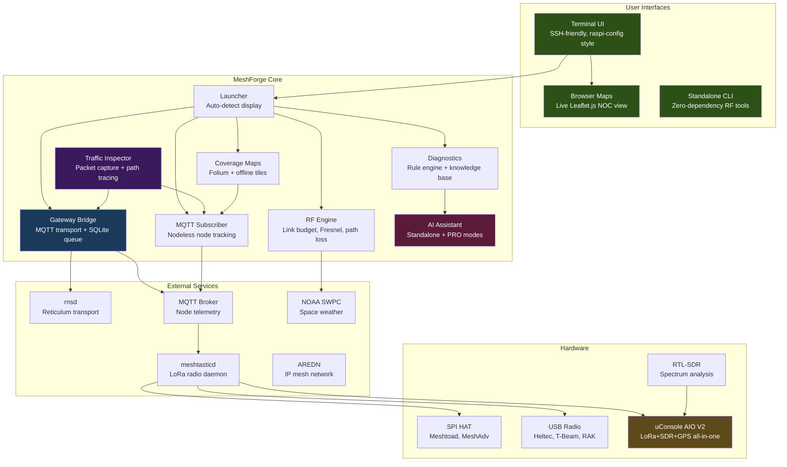
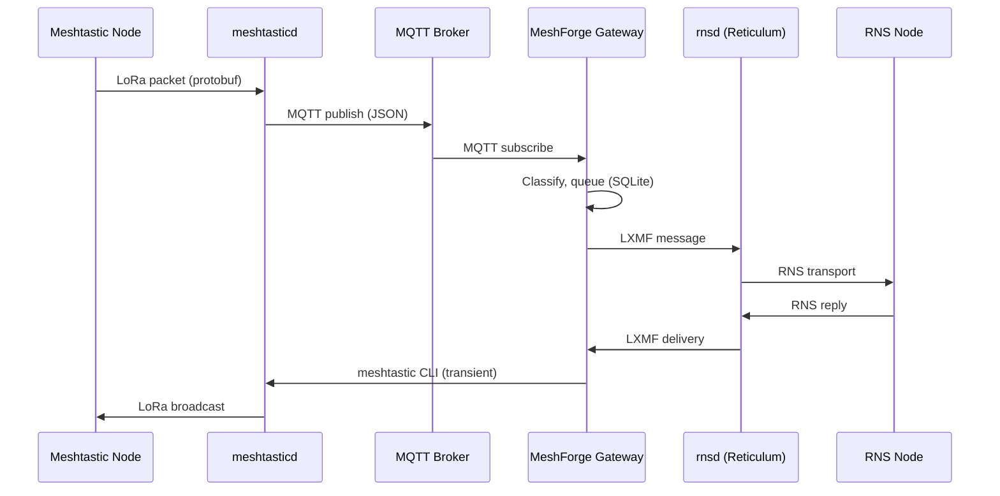

# Architecture

How the pieces fit, and where the code lives.

## Architecture



### Data Flow: MQTT Bridge (v0.5.4+)



**Key change in v0.5.4**: The gateway no longer holds a persistent TCP:4403 connection.
It receives via MQTT subscription and sends via transient CLI commands.
The web client on :9443 works uninterrupted.

### MQTT Architecture (Zero Interference)

All MeshForge components use MQTT. Nothing fights for the TCP connection:

```
meshtasticd
    ├── Web Client :9443    (always works, no interference)
    ├── TCP:4403            (available for meshtastic CLI, one client)
    │
    └── MQTT → mosquitto:1883 → MeshForge Gateway (bridge to RNS)
                              → MQTT Subscriber (monitoring)
                              → Traffic Inspector (packet capture)
                              → Coverage Maps (position data)
                              → Grafana/InfluxDB
                              → other consumers (unlimited)
```

**Setup:**
```bash
sudo apt install mosquitto                     # MQTT broker
./templates/mqtt/meshtasticd-mqtt-setup.sh     # Configure meshtasticd MQTT
# TUI: Gateway Config → Templates → mqtt_bridge
```

**Setup via TUI**:
- Gateway Bridge: `Mesh Networks → Gateway Config → Templates → mqtt_bridge`
- MQTT Monitor: `Mesh Networks → MQTT Monitor → Configure → Use Local Broker`
- MQTT Settings: `Gateway Config → MQTT Bridge Settings → Run Setup Guide`

For the end-to-end gateway deployment recipe, which bridge flags control what, and the refusal-on-inconsistency contract, see **[Gateway Deployments](#gateway-deployments)** below and the detailed **[docs/GATEWAY_DEPLOYMENT.md](GATEWAY_DEPLOYMENT.md)**.

### Dual-Radio Failover

Meshtastic firmware silently drops position and telemetry sends when channel utilization
exceeds 25%. MeshForge addresses this with a dual-radio failover state machine
(`gateway/radio_failover.py`) that monitors two meshtasticd instances and automatically
switches the active TX path:

```
PRIMARY_ACTIVE → FAILOVER_PENDING → SECONDARY_ACTIVE
       ↑                                    |
       └──── RECOVERY_PENDING ──────────────┘
```

- **Health polling**: HTTP `/json/report` every 5 seconds (no TCP contention)
- **Trigger**: Sustained >25% channel utilization for 30 seconds
- **Recovery**: Primary drops below 15% and holds stable for 60 seconds
- **Safety**: Max 6 failovers/hour, 30-second cooldown, anti-flap stabilization

Requires two meshtasticd instances on ports 4403 (primary) and 4404 (secondary) with
HTTP APIs enabled. Enable via TUI or `failover.enabled: true` in gateway config.

### Design Principles

- **TUI is a dispatcher** — selects what to run, not how to run it
- **Services run independently** — MeshForge connects, never embeds
- **Standard Linux tools** — `systemctl`, `journalctl`, `meshtastic`, `rnstatus`
- **Config overlays** — writes to `config.d/`, never overwrites defaults
- **Graceful degradation** — missing dependencies disable features, don't crash
- **Defense-in-depth** — handler registry dispatches with exception isolation per handler

---

## Project Structure

```
src/
├── launcher_tui/          # Terminal UI (primary interface)
│   ├── main.py            # NOC dispatcher + handler registration
│   ├── handler_protocol.py  # CommandHandler Protocol + TUIContext + BaseHandler
│   ├── handler_registry.py  # HandlerRegistry — register/lookup/dispatch
│   ├── backend.py         # whiptail/dialog abstraction
│   ├── startup_checks.py  # Environment checks + conflict resolution
│   ├── status_bar.py      # Service status bar
│   └── handlers/          # <!--STAT:handlers-->102<!--/STAT--> command-handler modules
├── commands/              # Command modules
│   ├── propagation.py     # Space weather & HF propagation (NOAA primary)
│   ├── rns.py             # RNS/Reticulum commands
│   ├── meshtastic.py      # Meshtastic CLI integration
│   ├── hamclock.py        # HamClock client (optional/legacy)
│   └── ...                # gateway, hardware, messaging, diagnostics, service
├── plugins/               # Protocol plugins
│   ├── eas_alerts.py      # NOAA/NWS/FEMA emergency alerts
│   ├── meshcore.py        # MeshCore plugin (optional gateway handler)
│   └── mqtt_bridge.py     # MQTT bridge plugin
├── gateway/               # Multi-mesh bridge
│   ├── rns_bridge.py      # Meshtastic ↔ RNS transport
│   ├── mqtt_bridge_handler.py # MQTT-based bridge (zero interference)
│   ├── message_queue.py   # Persistent SQLite queue
│   ├── node_tracker.py    # Unified node discovery
│   ├── meshtastic_protobuf_client.py  # Protobuf-over-HTTP transport
│   └── ...                # circuit_breaker, reconnect, network_topology, templates
├── monitoring/            # Network monitoring
│   ├── mqtt_subscriber.py # Nodeless MQTT node tracking
│   ├── traffic_inspector.py # Packet capture + protocol analysis
│   ├── rns_sniffer.py     # RNS packet capture + announce tracking
│   ├── path_visualizer.py # Multi-hop path tracing
│   └── ...                # node_monitor, tcp_monitor, packet_dissectors
├── utils/                 # Core utilities (100+ modules)
│   ├── rf.py              # RF calculations (well-tested)
│   ├── coverage_map.py    # Folium map generator + tile cache
│   ├── config_api.py      # RESTful configuration API
│   ├── service_check.py   # Service management + RNS shared instance detection (single source of truth)
│   ├── diagnostic_engine.py # Rule-based AI diagnostics
│   ├── claude_assistant.py  # AI assistant (Standalone + PRO)
│   ├── mesh_alert_engine.py # Mesh alert engine (battery, emergency, disconnect, SNR)
│   ├── demo_mode.py        # Simulated mesh traffic (uses meshing_around MockAPI)
│   ├── mqtt_decryptor.py   # AES-256-CTR packet decryption bridge
│   ├── knowledge_base.py   # Core knowledge base + 20 topics
│   ├── prometheus_exporter.py # Prometheus/Grafana metrics
│   ├── uconsole.py        # uConsole AIO V2 hardware profile
│   ├── aredn.py           # AREDN mesh client
│   ├── paths.py           # Sudo-safe path resolution
│   ├── watchdog_runner.py # Watchdog: one probe per field-learned failure class
│   └── ...                # metrics, webhooks, topology, device_backup, wifi_ap, etc.
├── mini_dudeai/           # Stdlib-only rule-loop agent (see AI Intelligence)
├── standalone.py          # Zero-dependency RF tools
└── __version__.py         # Version tracking

dashboards/                # Grafana monitoring dashboards
├── meshforge-overview.json  # Health, services, queues
├── meshforge-nodes.json     # Per-node RF metrics
├── meshforge-gateway.json   # Gateway bridge status
├── meshforge-infinity.json  # JSON API via Infinity plugin (no Prometheus required)
└── meshforge-influxdb.json  # Node trends + signal quality via InfluxDB

templates/
└── gateway-pair/          # Multi-preset bridging templates
    ├── node-a.yaml        # First gateway node config
    └── node-b.yaml        # Second gateway node config
```

---

